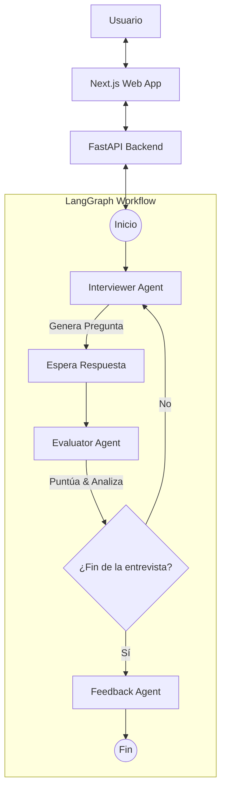

# Proyecto: Mock Interview Agents
## Sistema Multiagente para Simulación de Entrevistas Técnicas

Este documento presenta una visión completa de la aplicación "Mock Interview Agents", diseñada como proyecto para la asignatura de **Sistemas Multiagentes**.

---

## 1. Visión General

**Mock Interview Agents** es una plataforma interactiva impulsada por Inteligencia Artificial diseñada para simular entrevistas de trabajo técnicas y conductuales. El sistema permite a los usuarios practicar entrevistas para diversos roles (como Backend Developer, Frontend Developer, Product Manager) y niveles de experiencia, recibiendo retroalimentación inmediata y detallada.

El núcleo del sistema es una arquitectura multiagente donde diferentes agentes especializados colaboran para conducir la entrevista, evaluar las respuestas y proporcionar coaching personalizado.

---

## 2. Objetivos

### Objetivo Principal
Desarrollar un sistema inteligente capaz de simular el rol de un entrevistador humano experto, proporcionando un entorno seguro y educativo para que los candidatos mejoren sus habilidades.

### Objetivos Específicos
1.  **Simulación Realista:** Generar preguntas contextuales adaptadas al rol y nivel de experiencia del candidato, no preguntas estáticas predefinidas.
2.  **Evaluación Objetiva y Subjetiva:** Combinar análisis lingüístico (NLP) con lógica difusa (Fuzzy Logic) para evaluar métricas "blandas" como claridad, confianza y relevancia.
3.  **Orquestación de Agentes:** Implementar un flujo de trabajo deliberativo utilizando **LangGraph** donde múltiples agentes coordinen el estado de la entrevista.
4.  **Retroalimentación Constructiva:** Proporcionar un análisis final detallado con fortalezas, debilidades y recursos de aprendizaje recomendados.

---

## 3. Arquitectura

El sistema sigue una arquitectura moderna de cliente-servidor, desacoplada y escalable.

### 3.1 Stack Tecnológico

*   **Frontend:**
    *   **Framework:** Next.js 16 (App Router)
    *   **UI Library:** React 19, Tailwind CSS 4, Shadcn/UI
    *   **Lenguaje:** TypeScript
*   **Backend:**
    *   **API:** FastAPI (Python)
    *   **Orquestación:** LangGraph
    *   **NLP:** spaCy
    *   **Lógica Difusa:** scikit-fuzzy / lógica personalizada
    *   **LLMs:** Integración con OpenAI (GPT-4o-mini) o Anthropic

### 3.2 Sistema Multiagente (El Núcleo)

El backend implementa un flujo de trabajo basado en grafos donde interactúan tres agentes principales:

1.  **Interviewer Agent (Agente Entrevistador):**
    *   **Rol:** Conductor de la entrevista.
    *   **Tecnología:** LLM (Large Language Model).
    *   **Función:** Genera preguntas dinámicas basándose en el historial de la conversación, el rol deseado y el desempeño previo del candidato. Ajusta la dificultad sobre la marcha.

2.  **Evaluator Agent (Agente Evaluador):**
    *   **Rol:** Analista de calidad.
    *   **Tecnología:** NLP + Lógica Difusa (Determinista).
    *   **Función:** Analiza cada respuesta del usuario extrayendo características lingüísticas (sentimiento, complejidad, uso de muletillas). Utiliza lógica difusa para calcular puntuaciones de **Claridad**, **Confianza** y **Relevancia**.

3.  **Feedback Agent (Agente de Retroalimentación):**
    *   **Rol:** Coach / Mentor.
    *   **Tecnología:** LLM.
    *   **Función:** Al finalizar la sesión, compila toda la información de las evaluaciones y genera un reporte exhaustivo en formato Markdown, sugiriendo áreas de mejora específicas.

### 3.3 Diagrama de Flujo de Datos

---

## 4. Desafíos

Durante el desarrollo de este sistema multiagente, se abordaron varios desafíos técnicos y de diseño:

1.  **Orquestación de Estado:** Mantener el contexto de la conversación a lo largo de múltiples turnos (preguntas y respuestas) utilizando el grafo de estados de LangGraph fue crucial para evitar que el entrevistador "olvidara" lo que ya se había discutido.
2.  **Hibridación de Evaluación:** Combinar la evaluación subjetiva de un LLM (que entiende el significado) con la evaluación objetiva de la lógica difusa (que mide métricas cuantificables) para ofrecer una puntuación justa y útil.
3.  **Latencia:** Los LLMs pueden ser lentos. Se optimizó el flujo para que la evaluación ocurra de manera eficiente y la interfaz de usuario maneje los estados de carga de forma elegante.
4.  **Ingeniería de Prompts:** Diseñar prompts robustos para asegurar que el `InterviewerAgent` no repita preguntas y mantenga un tono profesional, y que el `FeedbackAgent` proporcione consejos accionables y no genéricos.

---

## 5. Demostración

La demostración del proyecto cubre el siguiente flujo de usuario:

1.  **Configuración de la Sesión:**
    *   El usuario selecciona un perfil (ej. "Senior Backend Engineer").
    *   El usuario elige áreas de enfoque (ej. "System Design", "Databases").

2.  **El Ciclo de Entrevista:**
    *   El **Interviewer Agent** presenta una pregunta.
    *   El usuario responde (simulando una respuesta real hablada o escrita).
    *   El sistema muestra indicadores de progreso visual.

3.  **Evaluación en Tiempo Real:**
    *   Internamente, el **Evaluator Agent** procesa la respuesta.
    *   (Opcional) Se puede mostrar feedback inmediato o guardarlo para el final.

4.  **Resultados y Feedback:**
    *   Al completar las preguntas (o terminar manualmente), se activa el **Feedback Agent**.
    *   Se presenta un dashboard con:
        *   Puntuación general.
        *   Gráficos de radar/barras para habilidades específicas.
        *   Recomendaciones detalladas y recursos de estudio.

---

## 6. Conclusiones

*   **Eficacia de los Agentes:** La arquitectura multiagente demostró ser superior a un solo prompt gigante de LLM. La especialización de agentes permite un mejor control de calidad y una depuración más sencilla.
*   **Valor Educativo:** La herramienta ofrece un valor tangible para estudiantes y profesionales, proporcionando un entorno de "bajo riesgo" para practicar habilidades críticas.
*   **Escalabilidad:** La arquitectura desacoplada permite agregar fácilmente nuevos agentes (por ejemplo, un agente que verifique código en tiempo real) o nuevos tipos de entrevistas sin reescribir el sistema base.

